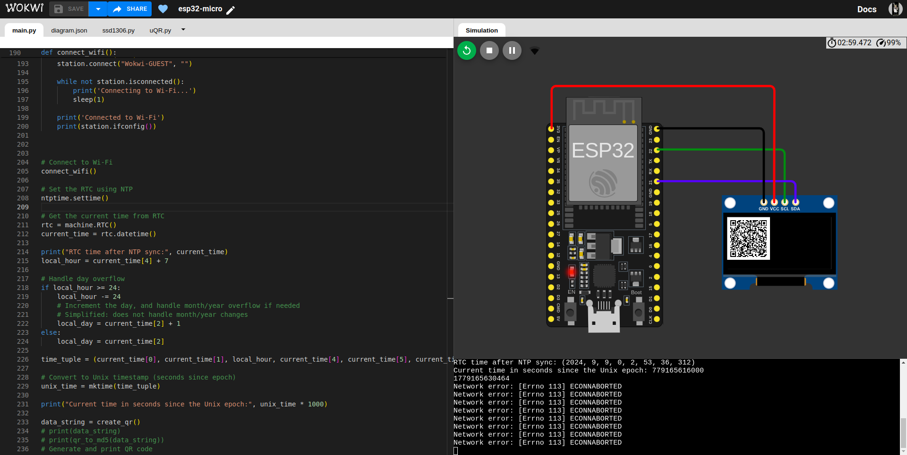

Here’s a basic structure for a README file for your GitHub repository:

---

# ESP32 QR Code Generator with OLED Display

This project demonstrates how to generate a KHQR code using an ESP32, display it on an OLED screen, and compute CRC16 and MD5 checksums to confirm trasition payment using MicroPython.

## Features

- **KHQR Code Generation:** Create a static QR code for payment using the Bakong system.
- **CRC16 & MD5 Checksum Calculation:** Verify data integrity with CRC16 and MD5.
- **OLED Display:** Display the generated QR code on an SSD1306 OLED screen.

## Hardware Requirements

- ESP32 Development Board
- SSD1306 OLED Display (I2C)
- Jumper Wires

## Software Requirements

- [MicroPython v1.22.0](https://micropython.org/download/esp32/) on ESP32
- Python Libraries: `machine`, `network`, `urequests`, `ujson`, `utime`, `uQR`, `ntptime`, `ssd1306`, `math`

## Setup and Usage

### 1. Wiring the OLED Display
- **SDA (Display)** to **GPIO 21 (ESP32)**
- **SCL (Display)** to **GPIO 22 (ESP32)**
- **VCC (Display)** to **3.3V (ESP32)**
- **GND (Display)** to **GND (ESP32)**

### 2. Code Upload
1. Install MicroPython on your ESP32 board if you haven’t done so.
2. Use a tool like [Thonny](https://thonny.org/) or [ampy](https://github.com/scientifichackers/ampy) to upload the code to your ESP32.

### 3. Running the Code
- Power the ESP32, and the OLED will display the KHQR code along with timestamp information.
- The code computes and displays the CRC16 and MD5 checksums for verification.

### 4. Example Output

